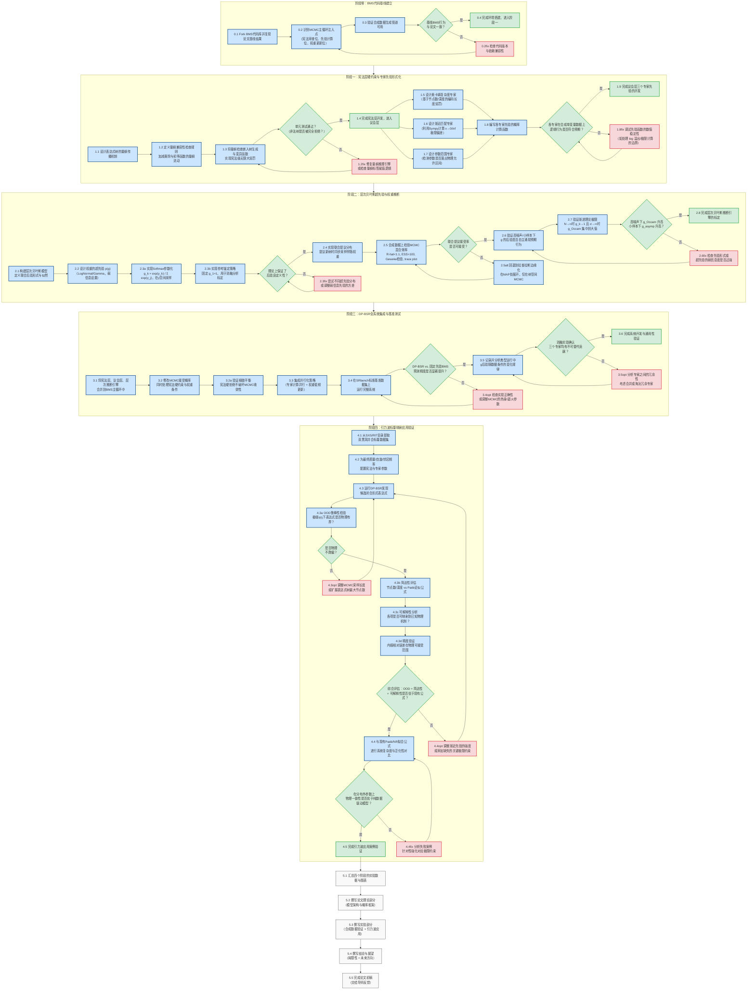

```mermaid
graph TD
    %% ==================== 阶段零 ====================
    subgraph Phase0[阶段零：BMS代码基线建立]
        Z1[0.1 Fork BMS代码库并复现论文基线结果] --> Z2[0.2 识别MCMC主循环注入点<br>（宪法审查位、先验计算位、权重更新位）]
        Z2 --> Z3[0.3 验证合成数据生成管道可用]
        Z3 --> Z4{基线BMS行为<br>与论文一致？}
        Z4 -->|是| Z5[0.4 完成环境搭建，进入阶段一]
        Z4 -->|否| Z2Fix[0.2fix 检查代码版本<br>与依赖兼容性]
        Z2Fix --> Z2
    end

    %% ==================== 阶段一 ====================
    subgraph Phase1[阶段一：宪法层硬约束与专家先验形式化]
        A1[1.1 设计表达式树的量纲传播机制] --> A2[1.2 定义量纲兼容性检查规则<br>加减乘除与初等函数的量纲流动]
        A2 --> A3[1.3 将量纲检查嵌入树生成与变异函数<br>实现宪法级无限大惩罚]
        A3 --> A4{单元测试通过？<br>（非法树是否被完全拒绝？）}
        A4 -->|是| A5[1.4 完成宪法层开发，进入议会层]
        A4 -->|否| A2Fix[1.2fix 修复量纲推理引擎<br>或检查量纲标签赋值逻辑]
        A2Fix --> A3
        A5 --> B1[1.5 设计奥卡姆复杂度专家<br>（基于节点数/深度的编码长度惩罚）]
        A5 --> B2[1.6 设计渐近匹配专家<br>（利用Sympy计算 x→0/inf 极限偏差）]
        A5 --> B3[1.7 设计参数范围专家<br>（检测参数是否落出物理允许区间）]
        B1 & B2 & B3 --> B4[1.8 编写各专家先验的概率计算函数]
        B4 --> B5{各专家在合成单变量数据上<br>逻辑行为是否符合预期？}
        B5 -->|是| B6[1.9 完成议会层三个专家先验的开发]
        B5 -->|否| B4Fix[1.8fix 调试先验函数的数值稳定性<br>（如处理 log 溢出/极限计算的边界）]
        B4Fix --> B5
    end

    %% ==================== 阶段二 ====================
    subgraph Phase2[阶段二：层次贝叶斯超先验与权重推断]
        C1[2.1 构建层次贝叶斯模型<br>定义联合后验形式与似然]
        C1 --> C2["2.2 设计权重的超先验 p(g)<br>（LogNormal/Gamma，弱信息设置）"]
        C2 --> C3a["2.3a 实现Softmax参数化<br>g_k = exp(γ_k) / Σ exp(γ_j)，在γ空间采样"]
        C3a --> C3b[2.3b 实现参考锚定策略<br>固定 g_1=1，用于消融分析标定]
        C3b --> C4{理论上保证了<br>后验良定义性？}
        C4 -->|是| C5[2.4 实现联合提议分布<br>提议新树时同步采样伴随权重]
        C4 -->|否| C3Fix[2.3fix 尝试不同超先验分布<br>或调整弱信息先验的方差]
        C3Fix --> C4
        C5 --> C6[2.5 合成数据上检验MCMC混合效率<br>R-hat<1.1, ESS>100, Geweke检验, trace plot]
        C6 --> C7{联合提议接受率<br>是否可接受？}
        C7 -->|是| C8[2.6 验证高噪声/小样本下<br>g 的后验是否自主涌现预期行为]
        C7 -->|否| C_alt[2.5alt 回退到拉普拉斯边缘化<br>在MAP处展开，仅在树空间MCMC]
        C_alt --> C6
        C8 --> C8_limit[2.7 验证渐进理论极限<br>N→∞时 g_k→1 且 σ→∞时 g_Occam 集中到大值]
        C8_limit --> C9{高噪声下 g_Occam 升高<br>小样本下 g_asymp 升高？}
        C9 -->|是| C10[2.8 完成层次贝叶斯推断引擎的标定]
        C9 -->|否| C8Fix[2.6fix 检查先验形式或<br>超先验的弱信息度是否过强]
        C8Fix --> C8
    end

    %% ==================== 阶段三 ====================
    subgraph Phase3[阶段三：DP-BSR全系统集成与基准测试]
        D1[3.1 将宪法层、议会层、层次推断引擎<br>合并到BMS主循环中]
        D1 --> D2[3.2 修改MCMC接受概率<br>同时处理宪法硬约束与权重条件]
        D2 --> D2_detail[3.2a 验证细致平衡<br>宪法硬拒绝不破坏MCMC收敛性]
        D2_detail --> D3[3.3 集成并行化策略<br>（专家计算并行 + 权重低频更新）]
        D3 --> D4[3.4 在SRbench标准基准数据集上<br>运行完整系统]
        D4 --> D5{DP-BSR vs. 固定先验BMS<br>预测精度是否显著提升？}
        D5 -->|是| D6[3.5 记录并分析典型运行中<br>g后验随数据条件的变化规律]
        D5 -->|否| D4Opt[3.4opt 检查实现正确性<br>或调整MCMC的热身/退火参数]
        D4Opt --> D4
        D6 --> D7{消融实验确认<br>三个专家均有不可替代贡献？}
        D7 -->|是| D8[3.6 完成系统开发与通用性验证]
        D7 -->|否| D6Opt[3.5opt 分析专家之间的冗余性<br>考虑合并或淘汰冗余专家]
        D6Opt --> D6
    end

    %% ==================== 阶段四 ====================
    subgraph Phase4[阶段四：引力波标量映射应用验证]
        E1[4.1 从SXS/RIT目录提取<br>双黑洞并合标量数据集]
        E1 --> E2[4.2 为最终质量/自旋/铃宕频率<br>配置宪法与专家参数]
        E2 --> E3[4.3 运行DP-BSR发现<br>候选闭合形式表达式]
        E3 --> E4_OOD[4.3a OOD鲁棒性检验<br>极端q/χ下表达式是否物理有界？]
        E4_OOD --> E4_OOD_dec{是否物理<br>不跑偏？}
        E4_OOD_dec -->|否| E3Opt[4.3opt 调整MCMC采样长度<br>或扩展表达式树最大节点数]
        E3Opt --> E3
        E4_OOD_dec -->|是| E4_simple[4.3b 简洁性评估<br>节点数/深度 vs Padé近似公式]
        E4_simple --> E4_interp[4.3c 可解释性分析<br>各项是否可映射到已知物理机制？]
        E4_interp --> E4_error[4.3d 精度验证<br>内插相对误差在物理可接受范围]
        E4_error --> E5{综合评估：OOD + 简洁性<br>+ 可解释性是否优于现有公式？}
        E5 -->|是| E6[4.4 与现有Padé/NR拟合公式<br>进行系统复杂度与泛化性对比]
        E5 -->|否| E5Opt[4.4opt 调整渐近先验的强度<br>或添加缺失的关键极限约束]
        E5Opt --> E3
        E6 --> E7{在分布外参数上<br>物理一致性是否优于纯数据驱动模型？}
        E7 -->|是| E8[4.5 完成引力波应用案例验证]
        E7 -->|否| E6Opt[4.4fix 分析失败案例<br>针对性强化对应极限约束]
        E6Opt --> E6
    end

    %% ==================== 汇聚 ====================
    Phase0 --> Phase1
    Phase1 --> Phase2
    Phase2 --> Phase3
    Phase3 --> Phase4

    E8 --> F1[5.1 汇总四个阶段的实验数据与图表]
    F1 --> F2[5.2 撰写论文理论部分<br>（模型架构与概率框架）]
    F2 --> F3[5.3 撰写实验部分<br>（合成数据验证 + 引力波应用）]
    F3 --> F4[5.4 撰写结论与展望<br>（局限性 + 未来方向）]
    F4 --> F5[5.5 完成论文初稿<br>（交给导师反馈）]

    %% ==================== 样式优化 ====================
    classDef default fill:#f9f9f9,stroke:#333,stroke-width:1px;
    classDef success fill:#d4edda,stroke:#28a745,stroke-width:2px;
    classDef fail fill:#f8d7da,stroke:#dc3545,stroke-width:2px;
    classDef process fill:#cce5ff,stroke:#004085,stroke-width:2px;
    class A4,A5,B5,B6,C4,C7,C9,C10,D5,D7,D8,E4_OOD_dec,E5,E7,E8,Z4,Z5 success;
    class A2Fix,B4Fix,C3Fix,C8Fix,D4Opt,D6Opt,E3Opt,E5Opt,E6Opt,Z2Fix fail;
    class A1,A2,A3,B1,B2,B3,B4,C1,C2,C3a,C3b,C5,C6,C8,C8_limit,C_alt,D1,D2,D2_detail,D3,D4,D6,E1,E2,E3,E6,E4_OOD,E4_simple,E4_interp,E4_error,Z1,Z2,Z3 process;

    %% ==================== 失败路径注释 ====================
    click Z2Fix "确认Python版本、依赖版本与BMS原论文一致，排查环境配置问题"
    click A2Fix "修复量纲推理引擎的边界情况（如无量纲常数、复合单位的简化）"
    click B4Fix "处理先验数值稳定性，采用 log-sum-exp 技巧防止下溢"
    click C3Fix "调整超先验的方差或分布族（LogNormal→Gamma），确保权重对数据敏感"
    click C8Fix "检查超先验的方差是否太大导致权重对数据不敏感，或采样链是否充分收敛"
    click D4Opt "增加MCMC热身步数，或使用并行回火改善离散空间的探索"
    click D6Opt "分析专家间的Spearman秩相关性，考虑合并高度相关的专家"
    click E3Opt "适度放宽树节点限制，但需警惕过拟合，需用后验预测检验"
    click E5Opt "引入更精确的微扰理论渐近形式（如Taylor展开的阶数约束）"
    click E6Opt "分析OOD区域的失败案例，检查是缺极限约束还是先验权重太弱"
```
