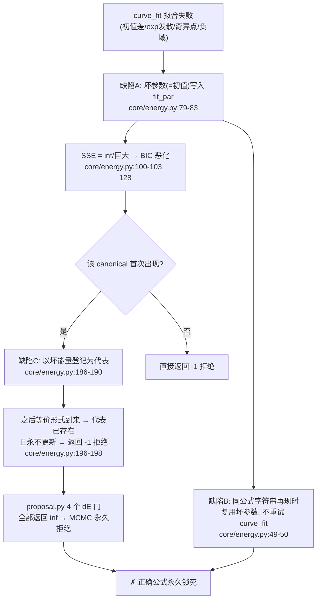

# 缺陷分析：拟合失败被缓存 + 代表永不更新导致的"正确公式永久锁死"

**日期**: 2026-09-04
**类型**: 缺陷分析（code inspection，未做动态复现实验）
**范围**: `core/energy.py`（对照上游 `machine-scientist/mcmc.py`,现在为`../mcmc.py.bak`）
**结论**: **确认存在**。dynamic-BMS 完整继承了上游 Bayesian Machine Scientist 的三个相互叠加的缺陷，且未做任何缓解。

---

## 1. 问题背景

BMS 的打分流程是：先把表达式树的全部自由参数用 `scipy.optimize.curve_fit` 拟合到最优，
再由 SSE 计算 BIC，最后得到能量 `E = BIC/2 + 先验惩罚`（近似负对数后验）。

这个流程隐含假设：**`curve_fit` 总能找到（接近）全局最优的参数**。
一旦拟合失败（收敛失败、碰到 `exp`/`fac` 发散、`sqrt`/`log` 负域、奇异点等），
SSE 会被记为 inf 或一个很大的值，BIC 随之恶化。
如果一个**数学上正确**的公式恰好在首次访问时拟合失败，它会被永久打上"坏公式"的标签，
再也无法翻案——这就是本报告要分析的"锁死"问题。

## 2. 三个叠加缺陷（与上游逐行对照）

### 缺陷 A：拟合失败的参数也被写入 `fit_par` 缓存

| | 上游 | dynamic-BMS |
|---|---|---|
| 位置 | `mcmc.py:685-689` | `core/energy.py:79-83` |
| 代码 | 相同 | 相同 |

```python
# core/energy.py:79-83（失败分支）
except:
    # Save this (unsuccessful) fit and print warning
    self.fit_par[str(self)][ds] = deepcopy(
        self.par_values[ds]      # ← 存的是未拟合的 p0 初值！
    )
```

`curve_fit` 抛异常时，`par_values[ds]` 里还是初始值（全部为 1.0 或移动前继承的旧值），
却被当作"拟合结果"存入缓存。注释写的是 `Save this (unsuccessful) fit`，
即作者明知是失败也照样缓存。

### 缺陷 B：缓存命中时直接复用，永不重试拟合

| | 上游 | dynamic-BMS |
|---|---|---|
| 位置 | `mcmc.py:655-656` | `core/energy.py:49-50` |
| 代码 | 相同 | 相同 |

```python
# core/energy.py:49-50
elif str(self) in self.fit_par: # Recover previously fit parameters
    self.par_values = self.fit_par[str(self)]
```

缓存无法区分"这次存的是成功拟合"还是"失败时随手存的初值"。
同一个公式字符串再次出现时，直接取出缺陷 A 存入的坏参数，**不会重新调用 `curve_fit`**。
该公式的能量从此被钉死在坏值上。

### 缺陷 C：`update_representative` 永不更新代表（作者自己注释掉了）

| | 上游 | dynamic-BMS |
|---|---|---|
| 位置 | `mcmc.py:797-801` | `core/energy.py:196-198` |
| 代码 | 相同（含同一段被注释的更新逻辑） | 相同 |

```python
# core/energy.py:196-198
else:
    # CAUTION: CHANGED TO NEVER UPDATE REPRESENTATIVE!!!!!!!!
    return -1
```

机制：`canonical` 标准形第一次出现时，以当时的能量登记为"代表"（`energy.py:186-190`）。
之后同一标准形的任何等价树到来，直接返回 `-1` → `proposal.py` 的 4 个 dE 门全部拒绝该移动
（`proposal.py:260, 352, 454, 525`）。

原设计本是"若新形式的能量比代表低 1e-6 以上，就更新代表"（代码仍保留在注释块里），
这正好可以给首次拟合失败的公式一次翻案机会。但该逻辑被禁用后：

- 首次访问时拟合失败 → 代表能量登记为 inf/很差；
- 等价形式永远被 `-1` 拒绝，**无法以更优拟合刷新代表**；
- 正确公式被永久逐出采样空间。

## 3. 锁死链条全景



三个缺陷单独看都"只是不优"，叠加后形成**不可逆的单向门**：第一次坏，永远坏。

## 4. dynamic-BMS 特有的观察

1. **无缓解改动**：`core/energy.py` 相对上游只做模块化拆分和 `parliaments` 结构惩罚
   （`get_energy` 中 `energy.py:155-156`，仅影响 EP 结构项，与拟合失败无关），
   三个缺陷处的代码与上游逐行一致。

2. **缓存键是 `str(self)`（树形字符串），而代表键是 `canonical()`**：
   两套键不一致意味着——等价但不同形的树各有独立的 `fit_par` 缓存，
   即使某棵等价树后来拟合成功，缺陷 C 也阻止它成为新代表。翻案的两条路都被堵死。

3. **已知日志已有征兆**：`log/test_phase1_2026-07-18.md:114-115` 记录了
   `curve_fit` 失败与 `OptimizeWarning` 是常态（"MCMC 自然会拒绝这些状态"）。
   这个判断对**错误的**公式成立，但对**正确却首次拟合失败**的公式恰恰是问题所在——
   当时没有被识别为缺陷。

4. **`core/README.md:72` 将 `fit_par` 缓存作为特性描述**（"避免重复拟合相同表达式"），
   未提及失败分支也缓存的副作用，文档与行为的风险不匹配。

5. 波及面：`tree_base.py:174`（`set_par_values` 也写 `fit_par`）、
   `tree_base.py:312`（`build_from_string` 清空缓存，这是唯一的"重置"机会，但 MCMC 运行中不会发生）。

## 5. 影响评估

| 场景 | 影响 |
|---|---|
| 简单公式、初值 1.0 即易拟合 | 几乎无影响（回归测试全过即因此） |
| 含 `exp`/`fac`/`**`/`sqrt`/`log` 的正确公式 | **高风险**：这些运算最易让 `curve_fit` 发散，越是有趣的公式越容易被误杀 |
| 长链 MCMC 搜索复杂真值 | 搜索空间被单向门持续削去"暂时拟合失败"的区域，且不可逆，可能系统性偏离真值 |
| 多数据集（dict x/y） | 更严重：缺陷 A 按数据集逐个缓存，部分数据集失败也会污染整体 |

无法从静态分析给出定量概率；如需量化，建议做一次注入实验：人为让某正确公式首次拟合失败
（如把初值改到发散域），观察其 canonical 是否永不再被接受。

## 6. 修复建议（按优先级）

1. **失败不写缓存**（改动最小，收益最大）：
   `energy.py:79-83` 的 except 分支不再写 `fit_par`，让下次访问时重试 `curve_fit`。
   如需避免反复失败拖慢，可记录失败次数，重试 N 次后再放弃。

2. **缓存加"成功"标记**：`fit_par[str(self)]` 的值改为 `(par_values, success_flag)`，
   命中时若 `success_flag=False` 则重试拟合。向后兼容性需注意。

3. **多起点重试**：首次拟合失败时，从若干随机初值（如 ±0.1/±1/±10 缩放）各试一次取最优。
   `maxfev=10000` 的预算可分摊。

4. **恢复代表更新逻辑**：解除 `energy.py:196-214` 注释掉的"能量更低则更新代表"分支
   （注意原作者禁用它可能另有原因，如对称移动概率被破坏——恢复前需在回归测试中验证
   `update_representative` 返回 -2 时 `proposal.py` 各 dE 门的处理路径，
   目前代码只判断 `== -1`，-2 会落入"可接受"分支，语义正确）。

5. **对易发散运算加数值保护**：`lambdify` 模块字典中为 `exp`/`fac` 等提供裁剪版本
   （如 `exp(clip(x, -700, 700))`），从源头降低拟合失败率。

6. **文档同步**：若采纳以上修复，更新 `core/README.md:72` 的缓存机制描述。

## 7. 附：核查方法

纯代码审查：`core/energy.py` 与上游 `machine-scientist/mcmc.py` 对应函数逐段对照；
全仓 grep 确认 `fit_par` / `curve_fit` / `update_representative` 无第二处实现
（`mcmc.py.bak` 为旧版备份，不在运行路径上；`gate/`、`experts/`、`inference/` 均未涉及）。
本报告未运行动态实验，第 5 节影响评估为定性判断。
